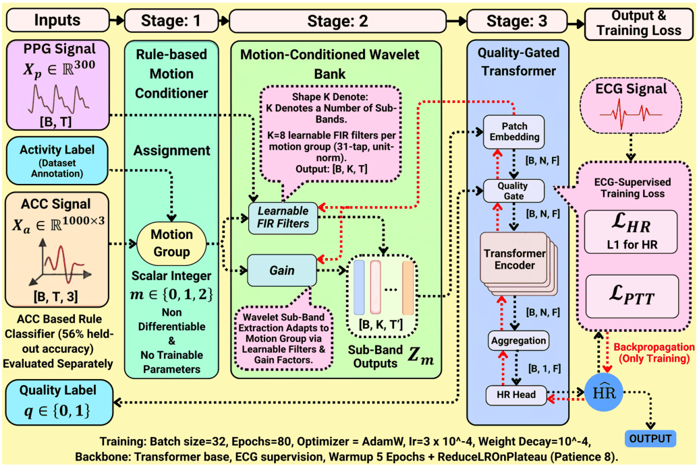
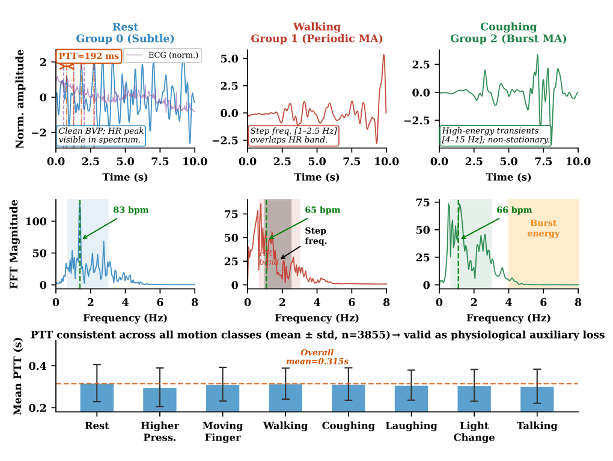
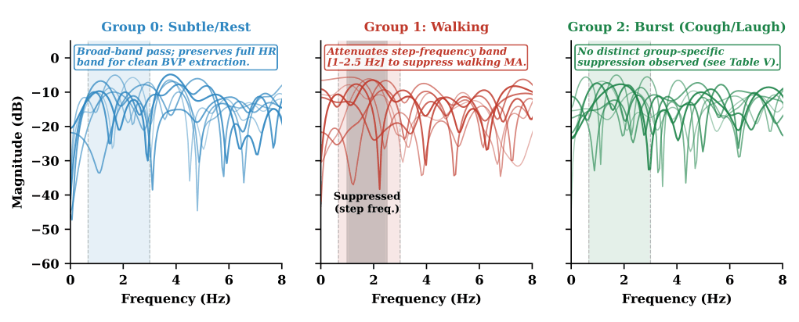
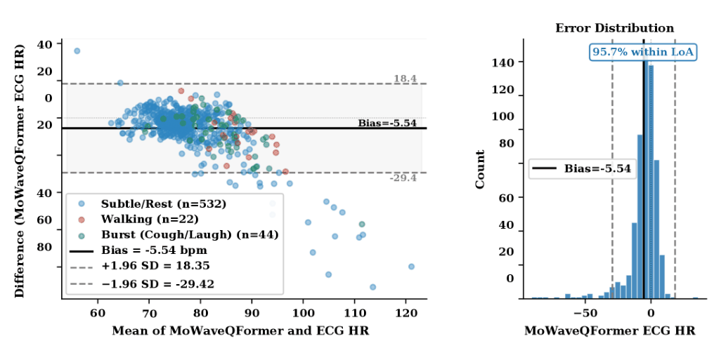

<h1 align="center">MoWaveQFormer</h1>
<p align="center"><strong>A Motion-Conditioned Quality-Gated Transformer<br>for Smartphone-Based PPG Heart Rate Estimation</strong></p>
<p align="center">
<a href="https://arxiv.org/abs/2609.16248"></a>


</p>
<p align="center">Research portfolio of <a href="https://github.com/rifat-binreza"><strong>Rifat Bin Reza</strong></a> · Second author of the associated preprint</p>
<p align="center"><a href="https://arxiv.org/pdf/2609.16248">Read the paper</a> · <a href="#system-architecture">Architecture</a> · <a href="#dataset-and-evaluation">Dataset</a> · <a href="#benchmark-results">Results</a> · <a href="#getting-started">Getting started</a></p>

---

## Overview

Smartphone photoplethysmography (PPG) makes heart-rate sensing accessible, but motion artifacts and poor signal quality can obscure the physiological waveform. **MoWaveQFormer** conditions the processing path on motion type and softly weights signal reliability before Transformer encoding.

The research combines:

- **Motion-conditioned filtering:** three groups select distinct banks of learnable FIR filters.
- **Quality-gated representation learning:** a differentiable soft gate retains low-quality windows instead of discarding them.
- **Physiological supervision:** ECG-derived heart rate and a pulse-transit-time (PTT) consistency term guide training.
- **Subject-independent evaluation:** subjects are separated across training, validation and test partitions.

This repository presents the paper's architecture, figures and reported evidence alongside the available notebook, logs and documentation. The preprint is available at [arXiv:2609.16248](https://arxiv.org/abs/2609.16248).

---

## System architecture

<p align="center"></p>
<p align="center"><em>Figure 1. Three-stage MoWaveQFormer architecture, reproduced from the paper.</em></p>

| Stage | Operation | Paper configuration |
| :--- | :--- | :--- |
| Input preparation | Per-window min-max normalization to [-1, 1] | 10-second PPG: 300 samples at 30 Hz; ACC: 1,000 samples × 3 axes at 100 Hz |
| Motion conditioning | Assign a discrete group index | Subtle/rest, walking, or burst motion; annotated groups used in reported experiments |
| Learnable filter bank | Select motion-specific FIR filters and gains | 3 groups × 8 filters; 31 taps; 768 trainable parameters including gains |
| Patch embedding | Flatten and project filtered sub-bands | 30 patches × 10 samples; 80-dimensional patch input projected to 128 dimensions |
| Quality gate | Multiply embeddings by learned sigmoid weights | Binary SQI is used as a conditioning input; poor-quality tokens remain available |
| Transformer encoder | Encode temporal relationships | 4 layers; 4 heads; model dimension 128; feed-forward dimension 512; dropout 0.1 |
| Regression head | Pool tokens and estimate HR | Global average pooling; 128 → 64 → 1 head |
| Training objective | ECG-supervised L1 HR loss plus PTT consistency | PTT weight 0.1; consistency applied where a valid PTT target exists |

**Evaluation context:** the reported results use recorded activity annotations to assign motion groups. The rule-based accelerometer classifier was assessed separately and achieved **56% held-out agreement**; deployment using that classifier is not equivalent to the annotated-group evaluation.

---

## Dataset and evaluation

The study uses **BUT PPG v2.0**, containing **3,888 ten-second recordings from 50 subjects**. Each record includes smartphone PPG, reference ECG and a binary signal-quality label. Synchronized tri-axial accelerometer data are available for **3,840 recordings**.

| Partition | Subjects | Recordings | Share |
| :--- | ---: | ---: | ---: |
| Training | 35 | 2,742 | 70.5% |
| Validation | 7 | 548 | 14.1% |
| Test | 8 | 598 | 15.4% |
| **Total** | **50** | **3,888** | **100%** |

| Signal-quality label | Recordings | Share |
| :--- | ---: | ---: |
| Poor quality | 3,058 | 78.7% |
| Good quality | 830 | 21.3% |

The three motion groups have test-set counts of **532 subtle/rest**, **22 walking** and **44 burst-motion** windows. This imbalance matters when interpreting pooled and activity-specific results.

### Motion artifacts and physiological consistency

<p align="center"></p>
<p align="center"><em>Figure 2. Motion-specific corruption patterns and PTT measurements from the paper.</em></p>

Walking introduces approximately periodic artifacts that overlap the heart-rate band; coughing produces transient, broadband corruption. The PTT analysis provides physiological context for the auxiliary training constraint.

---

## Benchmark results

**Overall ECG-reference evaluation on 598 held-out recordings** (paper, Table II):

| Method | MAE (bpm) ↓ | RMSE (bpm) ↓ | Pearson r ↑ |
| :--- | ---: | ---: | ---: |
| TROIKA | 20.559 | 26.129 | 0.124 |
| Harmonic-SP | 21.497 | 26.686 | 0.180 |
| DeepPPG | 8.430 | 13.846 | 0.152 |
| CNN-BiLSTM | 8.479 | 14.015 | 0.067 |
| ResNet1D | 8.175 | 14.246 | 0.101 |
| **MoWaveQFormer** | **7.851** | **13.377** | **0.292** |

MoWaveQFormer has the lowest reported MAE/RMSE and highest correlation in this comparison. The paired Wilcoxon test reports significant differences versus Harmonic-SP, DeepPPG and CNN-BiLSTM; the comparison with ResNet1D is **not statistically significant** (p = 0.319). These are paper-reported results, not newly rerun experiments.

### Performance by signal quality

| Method | Poor-quality MAE (bpm) | Good-quality MAE (bpm) |
| :--- | ---: | ---: |
| ResNet1D | 9.386 | **4.606** |
| **MoWaveQFormer** | **8.805** | 4.609 |

The clearest pooled quality benefit is on poor-quality windows. ResNet1D is marginally better on the good-quality subset (paper, Table IV).

### Ablation study

| Variant | Validation MAE (bpm) | Change from full model |
| :--- | ---: | ---: |
| Full MoWaveQFormer | 7.162 | — |
| Shared filter bank; no motion conditioning | 7.079 | -0.083 |
| Uniform gate; no quality conditioning | 7.283 | +0.121 |
| No PTT constraint | 7.305 | +0.143 |

The paper's ablations show that removing quality gating or PTT consistency increases validation MAE. Removing motion conditioning slightly improves the pooled validation result, while motion-specific benefits appear in the walking and burst-motion comparisons. The [paper guide](docs/PAPER_GUIDE.md) explains this distinction.

### Learned filter responses

<p align="center"></p>
<p align="center"><em>Figure 3. Learned filter responses for the three motion groups.</em></p>

The walking bank shows greater attenuation in the stride-frequency region. The burst group does not show comparable, distinct band suppression; the paper discusses the limits of fixed filters for transient artifacts.

### Agreement with ECG reference

<p align="center"></p>
<p align="center"><em>Figure 4. ECG-reference agreement on the test set, reproduced from the paper.</em></p>

Reported mean bias is **-5.54 bpm**, with 95% limits of agreement **[-29.42, 18.35] bpm**. **95.7%** of test errors fall within those limits. Agreement should be read alongside error metrics rather than as a claim of clinical readiness.

### Model size and latency

| Measure | Paper-reported value |
| :--- | ---: |
| Trainable parameters | 816,445 |
| GPU inference per 10-second window | 2.04 ± 0.11 ms |
| CPU inference per 10-second window | 2.63 ± 0.21 ms |

Latency was measured on Kaggle cloud infrastructure, batch size 1, over 200 forward passes after warmup. Smartphone-device latency was not measured.

---

## Getting started

```bash
git clone https://github.com/rifat-binreza/MoWaveQFormer.git
cd MoWaveQFormer
```

1. Read the [paper](https://arxiv.org/pdf/2609.16248) and [paper guide](docs/PAPER_GUIDE.md).
2. Explore the [available research notebook](notebooks/brnodatajournal.ipynb) and [execution log](results/logs/kaggle-run.txt).
3. Inspect the [paper benchmark CSV](results/paper-benchmarks.csv).
4. Review the [reproducibility notes](docs/REPRODUCIBILITY.md) before attempting execution.

The repository contains a research summary and available supporting artifacts; it does not yet constitute a complete, independently verified reproduction package with released trained weights. The older [metrics snapshot](results/metrics.csv) is retained separately from the paper-labelled benchmark table.

## Repository guide

| Location | Contents |
| :--- | :--- |
| [assets/](assets/) | Four paper figures and figure provenance |
| [docs/PAPER_GUIDE.md](docs/PAPER_GUIDE.md) | Paper-grounded method details and evaluation context |
| [docs/METHODS.md](docs/METHODS.md) | Earlier public method notes |
| [docs/REPRODUCIBILITY.md](docs/REPRODUCIBILITY.md) | Available environment and execution notes |
| [notebooks/](notebooks/) | Available research notebook |
| [results/paper-benchmarks.csv](results/paper-benchmarks.csv) | Table II benchmark values |
| [results/metrics.csv](results/metrics.csv) | Earlier run snapshot, retained for traceability |
| [results/logs/](results/logs/) | Available execution logs |

## Citation

Use [CITATION.cff](CITATION.cff) or [citation.bib](citation.bib) for complete publication attribution.

**MoWaveQFormer: A Motion-Conditioned Quality-Gated Transformer for Smartphone-Based PPG Heart Rate Estimation** · arXiv:2609.16248 · 2026

[Read abstract](https://arxiv.org/abs/2609.16248) · [Download paper](https://arxiv.org/pdf/2609.16248) · [Rifat's Google Scholar](https://scholar.google.com/citations?user=U7HsBd4AAAAJ&hl=en)

## License and scope

Repository code is covered by the existing [MIT license](LICENSE). Paper figures retain their publication provenance; see [figure notes](assets/README.md). The reported evidence comes from one subject-level split of one dataset and does not establish cross-device generalization or clinical use.
